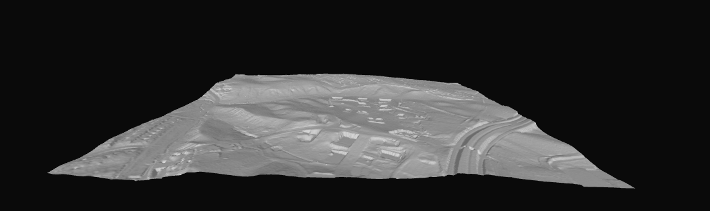

# GeoJSON Terrain Generator

Generate a georeferenced 3D terrain surface from a GeoJSON polygon using
[Mapterhorn](https://mapterhorn.com/) elevation tiles.

The project downloads the elevation data intersecting an area, decodes the
Terrarium RGB values, converts the samples into metre-based local coordinates,
clips the terrain to the supplied polygon, and exports the result as a GLB mesh.

The generated model is intended for:

- Three.js or other browser-based 3D viewers.
- Unity and simulation environments.
- UAV mission visualisation.
- Wildfire-management tools.
- Route, visibility, slope, and terrain-risk overlays.


## Files

```text
./src/build_terrain.py
    Main implementation and public Python API.

example.py
    Complete example using an in-memory GeoJSON object.

requirements.txt
    Python dependencies.
```

## Requirements

- Python 3.10 or newer.
- Internet access to `https://tiles.mapterhorn.com`.
- A GeoJSON polygon expressed in longitude/latitude coordinates using
  `EPSG:4326`.

Install the dependencies in a virtual environment:

```bash
python -m venv .venv
source .venv/bin/activate
pip install -r requirements.txt
```

## Quick start: Python API

Import `generate_terrain_from_geojson` and pass it a decoded GeoJSON object. This call creates a .glb file and a metadata.json with the filename and folde indicated in the args.


## Supported GeoJSON inputs

The API accepts the following decoded GeoJSON structures:

- `Polygon`
- `MultiPolygon`
- `Feature` containing a Polygon or MultiPolygon
- `FeatureCollection` containing one or more polygonal features

## Public API

```python
generate_terrain_from_geojson(
    geojson,
    output_path,
    *,
    zoom=15,
    sample_step=4,
    vertical_exaggeration=1.0,
    crs=None,
    max_tiles=64,
    workers=8,
    timeout=30.0,
)
```

### `geojson`

Decoded GeoJSON dictionary in `EPSG:4326`.

The function validates that:

- The geometry is polygonal.
- The geometry is not empty.
- Longitude lies between -180 and 180 degrees.
- Latitude lies inside the Web Mercator range.

For some invalid or self-intersecting polygons, the code attempts a standard
`buffer(0)` repair before rejecting the geometry.

### `output_path`

Destination path for the GLB model. The filename must end in `.glb`.

The parent directory is created automatically if it does not exist.

```python
output_path="generated/terrain.glb"
```

### `zoom`

Mapterhorn XYZ zoom level between 0 and 18.

A higher zoom retrieves more elevation pixels and produces a potentially denser
terrain. It does not necessarily improve the real source resolution. If the
underlying DEM has a resolution of 2 metres, requesting sub-metre tile pixels
only resamples that same information.

Approximate ground pixel sizes at latitude 42 degrees are:

| Zoom | Approximate metres per 512-tile pixel | Typical use |
|---:|---:|---|
| 12 | 14.2 m | Large regional overview |
| 13 | 7.1 m | Large wildfire area |
| 14 | 3.5 m | Operational terrain |
| 15 | 1.8 m | Detailed UAV area |
| 16 | 0.9 m | Small high-detail area |
| 17 | 0.4 m | Very small areas with suitable source data |

For most operational areas in Spain, zoom 14 or 15 is a sensible starting
point.

### `sample_step`

Retains one source elevation pixel for every `N` pixels in each direction.

```python
sample_step=1  # Full tile sampling
sample_step=2  # Half the rows and columns
sample_step=4  # One quarter of the rows and columns
sample_step=8  # Lightweight terrain
```

Reducing both dimensions has a quadratic effect. For a single 512 × 512 tile:

| Step | Approximate samples | Approximate grid triangles |
|---:|---:|---:|
| 1 | 262,144 | 522,242 |
| 2 | 65,536 | 130,050 |
| 4 | 16,384 | 32,258 |
| 8 | 4,096 | 7,938 |

The final number is normally lower because cells outside the polygon are
removed.

For browser and UAV visualisation, start with `sample_step=4`. Use the full
elevation raster separately if more detailed analytical operations are needed.

### `vertical_exaggeration`

Multiplier applied to local mesh Z coordinates:

```python
vertical_exaggeration=1.0  # Geometrically correct relief
vertical_exaggeration=1.5  # More visually pronounced relief
vertical_exaggeration=2.0  # Twice the real relative elevation
```

It does not modify the source elevation values recorded in the metadata.

Keep it at `1.0` when calculating slopes or
distances.

### `crs`

Optional projected coordinate reference system for the generated local mesh.

```python
crs="EPSG:25829"
```

If omitted, the code determines the WGS84 UTM zone containing the polygon
centroid.

For Spain, useful ETRS89 projections are:

| Region | CRS |
|---|---|
| Western Spain and Galicia | `EPSG:25829` |
| Central Spain | `EPSG:25830` |
| Eastern Spain and Balearic Islands | `EPSG:25831` |

The automatic CRS uses WGS84 UTM (`EPSG:326xx`) rather than ETRS89 UTM. The
difference is normally negligible for visualisation, but using an explicit CRS
is preferable when combining the mesh with an existing GIS system.

Do not supply `EPSG:4326`: it is geographic and uses degrees, whereas the mesh
requires a projected metre-based CRS.

### `max_tiles`

Maximum number of Mapterhorn tiles that one call may download.

This is a safety limit against accidentally requesting a very large region at a
high zoom:

```python
max_tiles=64
```

If the area exceeds the limit, the function raises an error before downloading
anything. Reduce `zoom`, split the region into smaller sectors, or deliberately
increase the limit after estimating the memory requirements.

### `workers`

Maximum concurrent tile downloads:

```python
workers=8
```

Increasing this can reduce download time, but should be done responsibly. It
does not parallelise mesh construction.

### `timeout`

Per-request HTTP timeout in seconds:

```python
timeout=30.0
```

### Return value

The function returns two `pathlib.Path` objects:

```python
terrain_path, metadata_path = generate_terrain_from_geojson(...)
```

## How the pipeline works

### 1. Validate and normalise the GeoJSON

The input dictionary is converted into a Shapely geometry. Polygon features in
a FeatureCollection are unioned, allowing both connected and disconnected
operational sectors.

The original geometry is assumed to use `EPSG:4326`.

### 2. Select a metric CRS

Longitude and latitude are angular coordinates. The generator therefore chooses a projected CRS, normally UTM. All final X, Y,
and Z values are expressed in metres.

### 3. Find intersecting XYZ tiles

The polygon bounding box is converted into a rectangular set of XYZ tile
indices at the selected zoom.

Mapterhorn exposes individual tiles at:

```text
https://tiles.mapterhorn.com/{z}/{x}/{y}.webp
```

Each tile is 512 × 512 pixels. `x` increases west to east and `y` increases
north to south.

The bounding-box tile selection can include tiles that only partially overlap
the polygon. The unwanted cells are removed during clipping.

### 4. Download and assemble the elevation mosaic

Tiles are downloaded concurrently and arranged into a single matrix:

```text
north
  ┌─────────┬─────────┐
  │ tile A  │ tile B  │
  ├─────────┼─────────┤
  │ tile C  │ tile D  │
  └─────────┴─────────┘
south
```

All tiles are placed according to their XYZ indices, so adjacent tile pixels
remain aligned.

### 5. Decode Terrarium elevations

Mapterhorn distributes Terrarium-encoded RGB data in WebP images. Every pixel
contains one elevation:

```text
elevation_m = R × 256 + G + B / 256 - 32768
```

The result is a floating-point elevation matrix in metres.

For example:

```python
elevations[row, column]
```

contains the elevation represented by one source pixel.

### 6. Compute the real position of every sample

The generator does not assign an arbitrary width and height to the image.
Instead, it calculates the exact global pixel centre in the XYZ pyramid:

```text
global pixel → EPSG:3857 → selected projected CRS
```

This is necessary because XYZ tiles use Web Mercator, where latitude is not
linearly distributed down the image.

For a tile grid at zoom `z`, the global Web Mercator image contains:

```text
512 × 2^z pixels per axis
```

The global pixel coordinate is converted to `EPSG:3857`, then transformed into
the selected UTM or projected CRS with PyProj.

As a result, the generated terrain has correct metre-based horizontal
dimensions. It is not stretched to a hard-coded size.

### 7. Create local mesh coordinates

Projected UTM coordinates can be numerically large. For example:

```text
X = 524,381 m
Y = 4,674,912 m
```

Large coordinates can reduce floating-point precision in Three.js, Unity, and
GLB renderers. The generator subtracts a local origin:

```text
local_x = projected_x - origin_x
local_y = projected_y - origin_y
local_z = (elevation - elevation_origin) × vertical_exaggeration
```

The GLB therefore contains compact local coordinates near zero. The removed
origin is recorded in the metadata and can be added back when converting local
positions to global projected coordinates.

### 8. Triangulate the elevation grid

Each group of four neighbouring samples forms one terrain cell:

```text
top-left ───── top-right
    │          / │
    │        /   │
    │      /     │
bottom-left ─ bottom-right
```

The cell is divided into two triangles:

```text
(top-left, bottom-left, top-right)
(top-right, bottom-left, bottom-right)
```

The winding order produces upward-facing normals.

### 9. Clip cells to the polygon

The centre of every terrain cell is tested against the projected polygon. Cells
whose centres lie outside the polygon or inside a polygon hole are discarded.

This method is efficient and works with:

- Concave polygons.
- Polygon holes.
- Disconnected MultiPolygons.

The boundary follows the sampled raster grid rather than cutting triangles
exactly along the GeoJSON edge. Decrease `sample_step` if a finer boundary is
required.

### 10. Export GLB and metadata

The retained vertices and triangles are exported with Trimesh as a binary glTF
file (`.glb`). Unreferenced vertices, degenerate triangles, and duplicate faces
are removed first.

The associated JSON file preserves the information needed to relate local GLB
coordinates to the real world.

## Metadata structure

An output file named:

```text
terrain.glb
```

produces:

```text
terrain.metadata.json
```

Example structure:

```json
{
  "source": "Mapterhorn",
  "source_url": "https://mapterhorn.com/",
  "tile_encoding": "Terrarium RGB in 512 px WebP",
  "zoom": 15,
  "tile_grid": {
    "min_x": 15591,
    "max_x": 15592,
    "min_y": 12147,
    "max_y": 12148,
    "count": 4
  },
  "local_crs": "EPSG:25829",
  "origin": {
    "x_m": 524000.0,
    "y_m": 4674000.0,
    "elevation_m": 30.3
  },
  "sample_step_pixels": 4,
  "vertical_exaggeration": 1.0,
  "elevation_m": {
    "minimum": 30.3,
    "maximum": 76.9
  },
  "mesh": {
    "vertices": 14859,
    "triangles": 29232,
    "bounds_local_m": []
  }
}
```

Values shown above are illustrative; tile indices and coordinates depend on the
input area.

## Converting between GLB and projected coordinates

Given a vertex or position in GLB-local coordinates:

```python
local_x = 250.0
local_y = 400.0
local_z = 35.0
```

recover the projected position using the metadata:

```python
projected_x = local_x + metadata["origin"]["x_m"]
projected_y = local_y + metadata["origin"]["y_m"]

elevation = (
    local_z / metadata["vertical_exaggeration"]
    + metadata["origin"]["elevation_m"]
)
```

To convert GPS position into the same local system:

```python
from pyproj import Transformer


transformer = Transformer.from_crs(
    "EPSG:4326",
    metadata["local_crs"],
    always_xy=True,
)

projected_x, projected_y = transformer.transform(longitude, latitude)

local_x = projected_x - metadata["origin"]["x_m"]
local_y = projected_y - metadata["origin"]["y_m"]
local_z = (
    altitude_m - metadata["origin"]["elevation_m"]
) * metadata["vertical_exaggeration"]
```

The resulting `(local_x, local_y, local_z)` can be placed in the same scene as
the terrain.

Make sure that the altitude and the DEM use compatible vertical references.
GNSS ellipsoidal altitude and DEM height above mean sea level are not always
equivalent.


## Error handling

The programmatic API raises exceptions instead of terminating the process.

```python
import requests

from mapterhorn_terrain import generate_terrain_from_geojson


try:
    terrain_path, metadata_path = generate_terrain_from_geojson(
        geojson=area,
        output_path="output/terrain.glb",
    )
except ValueError as error:
    print(f"Invalid request: {error}")
except requests.RequestException as error:
    print(f"Elevation download failed: {error}")
except RuntimeError as error:
    print(f"Terrain generation failed: {error}")
except OSError as error:
    print(f"Could not read or write a file: {error}")
```

Typical errors include:

- Invalid or empty polygon.
- Coordinates outside the Web Mercator range.
- Geographic CRS supplied instead of a projected CRS.
- Tile count exceeding `max_tiles`.
- Mapterhorn request failure or timeout.
- Sampling too coarse to retain any cell inside a very small polygon.
- Output path without the `.glb` extension.

## Performance and memory

The main memory consumers are:

- The full elevation mosaic.
- Projected X and Y coordinate grids.
- Vertex arrays.
- Triangle indices.

Tile count grows rapidly with zoom. Increasing zoom by one typically doubles
the number of tiles in each axis for the same area, resulting in approximately
four times as many tiles.

Recommended practices:

1. Use zoom 14 for large operational regions.
2. Use zoom 15 only when local terrain detail is necessary.
3. Start with `sample_step=4` for interactive viewing.
4. Preserve `max_tiles` as an API safety constraint.
5. Divide very large polygons into terrain sectors or quadtree chunks.
6. Cache downloaded source tiles when repeatedly generating nearby regions.
7. Use lower-detail meshes for distant terrain and higher-detail chunks near
   active UAVs or the fire perimeter.

`sample_step` reduces mesh density but does not currently reduce the size of the
downloaded Mapterhorn mosaic. For very large areas, lowering the zoom or using
PMTiles extracts is more effective.

## Limitations

### Surface rather than solid

The GLB contains the top terrain surface only. It has no bottom or side walls
and is therefore not watertight.

### Raster-aligned polygon boundary

Cells are selected using their centres. The output boundary approximates the
polygon at the chosen terrain sampling resolution.

### No texture or aerial imagery

The generator exports geometry, not orthophoto textures, land-cover materials,
roads, buildings, or vegetation.

These can be added as separate georeferenced scene layers.

### No persistent tile cache

Every call currently downloads the required tiles again. A production service
should cache tiles by `(z, x, y)` while respecting the provider's current terms
and attribution requirements.

### Vertical datum differences

Elevation sources can use a vertical datum that differs from GNSS telemetry or
another external dataset. Verify the datum before using elevation differences
for safety-critical clearance decisions.

### UTM zone scope

One automatically selected UTM zone is suitable for compact areas. Polygons
crossing large distances, multiple UTM zones, or the antimeridian should be
split or handled with a deliberately selected projection.


## Mapterhorn data access and attribution

Mapterhorn distributes 512-pixel Terrarium-encoded WebP tiles through an XYZ
endpoint and also publishes PMTiles archives for area extraction.

Official resources:

- [Mapterhorn website](https://mapterhorn.com/)
- [Data access documentation](https://mapterhorn.com/data-access/)
- [Coverage information](https://mapterhorn.com/coverage/)
- [Source attribution](https://mapterhorn.com/attribution/)
- [Source repository](https://github.com/mapterhorn/mapterhorn)

Mapterhorn combines multiple open elevation datasets. Review and preserve the
applicable source attribution for the generated area, particularly when models
or derived datasets are redistributed.

## Running the example

After installing the dependencies:

```bash
python example.py
```

The example defines a small polygon inSspain and writes:

```text
output/terrain.glb
output/terrain.metadata.json
```

Edit the `area` object in `example.py` to test another location.


[Visualizacion from https://glbviewer.net/es]
